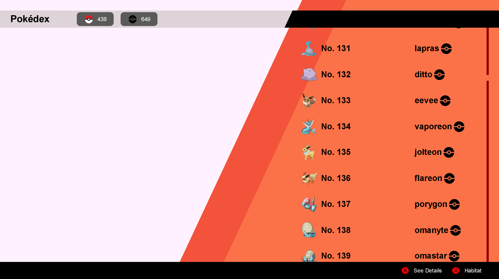
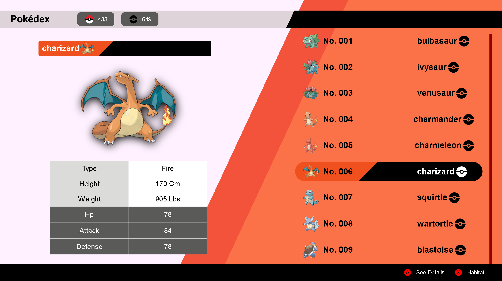
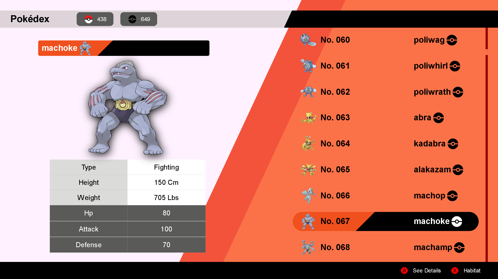

# React - Fundamentos

## Tecnologías Utilizadas:

- React (useState, useEffect)
- Api - pokeapi.co
- Git

---
## Descripción 📘 

Proyecto en el cual se utiliza la visualización condicional de componentes, visualizando a través del evento onMouseEnter el componente deseado, y ocultando al momento de dejarlo a través del evento onMouseLeave.
Además de mapear la información correspondiente que se consume a través de la Api, el orden como la distribución del contenido es a criterio opcional.

---
## Vista Principal 🎨
---

